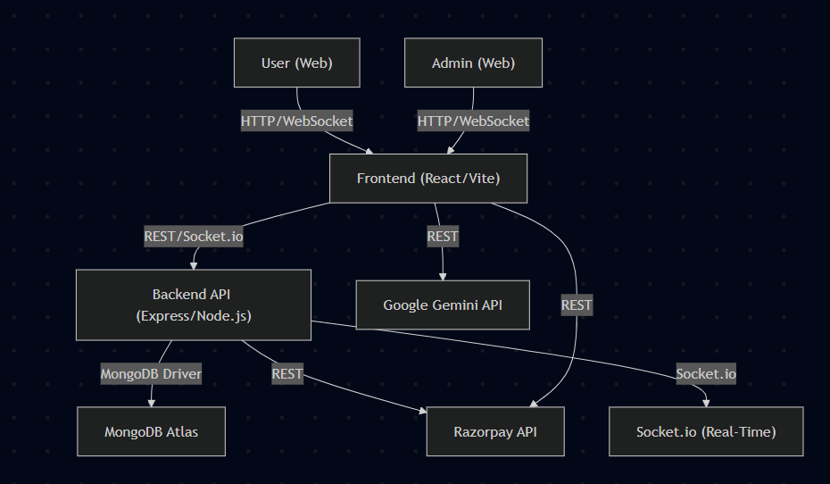

# Smart Health Care

A full-stack web application for online medical consultations, green drug encyclopedia, and digital health management.

---

## Table of Contents

- [Overview](#overview)
- [Features](#features)
- [System Modules](#system-modules)
- [Tech Stack](#tech-stack)
- [Architecture](#architecture)
- [Screenshots](#screenshots)
- [Setup & Installation](#setup--installation)
- [Environment Variables](#environment-variables)
- [Running the App](#running-the-app)
- [API Endpoints](#api-endpoints)
- [Testing](#testing)
- [Deployment](#deployment)
- [Project Workflow](#project-workflow)
- [Security & Best Practices](#security--best-practices)
- [Documentation](#documentation)
- [Demo & Links](#demo--links)
- [Contributing](#contributing)
- [License](#license)

---

## ⚠️ Security Warning: Environment Variables & Secrets

> **Never share or commit real secrets, API keys, or production credentials in public repositories or documentation.**
>
> - All keys, secrets, and environment variable values shown in this README are **placeholders only** (e.g., `your_razorpay_key`).
> - Replace them with your own real, secure values in your local `.env` files.
> - Never use the example secrets in production.
> - `.env` files are included in `.gitignore` and must **never** be committed to version control.
> - For production, always use strong, unique secrets and rotate them regularly.

---

## Overview

**Smart Health Care** is a platform that enables patients to:
- Instantly consult with certified doctors online (video & chat)
- Access a curated encyclopedia of traditional and modern treatments
- Book, pay for, and manage appointments
- Receive e-prescriptions and chat with doctors in real time
- Use an AI-powered symptom checker (Gemini)
- Admins can manage doctors, treatments, and payments

**Why?**
Immediate medical advice is often unavailable due to time, location, or resource constraints. This app bridges that gap by providing 24/7 access to medical expertise and wellness resources.

---

## Features

### User Features
- Register/Login (JWT-based)
- Search/filter doctors by specialty/location
- View doctor profiles, reviews, and availability
- Book appointments with real-time slot conflict checking
- Pay online (Razorpay integration)
- Join secure video consultations (WebRTC + Socket.io)
- Real-time chat with doctors (Socket.io)
- Receive e-prescriptions and doctor notes
- Leave reviews after completed appointments
- Explore a wellness encyclopedia (Ayurveda, Herbal, Lifestyle, etc.)
- AI-powered symptom checker (Google Gemini)
- Responsive UI (light/dark mode)

### Admin Features
- Admin login (JWT-based)
- Manage doctors (CRUD)
- Manage treatments (CRUD)
- View and update payment statuses
- View all users and appointments

### Security & Quality
- Modular, maintainable codebase (TypeScript everywhere)
- Robust error handling & defensive coding
- Logging (Winston)
- Input validation (Joi)
- Automated tests (Jest, Supertest, React Testing Library)
- Never commit secrets; use `.env` files

---

## System Modules

**Admin:**
- Login (with credentials)
- Post Doctor Details
- Post Treatment Details
- View Payment Details

**User:**
- Register/Login
- Search Doctor Details
- Search Treatment Details
- Book Appointments
- Post Payment Details

---

## Tech Stack

- **Frontend:** React 19, TypeScript, Tailwind CSS, Vite
- **Backend:** Node.js 18+, Express, TypeScript
- **Database:** MongoDB (Mongoose ODM)
- **Payments:** Razorpay (test mode)
- **Real-Time:** Socket.io (chat & video)
- **AI:** Google Gemini (symptom checker)
- **Other:** Winston (logging), Joi (validation), JWT (auth)
- **Testing:** Jest, Supertest, React Testing Library

---

## Architecture

 <!-- Replace with your actual diagram path -->

- **Frontend:** React SPA (Vite)
- **Backend:** REST API (Express)
- **Database:** MongoDB Atlas/local
- **Payments:** Razorpay API
- **Real-Time:** Socket.io for chat/video
- **Deployment:** Render, Railway, Heroku, Vercel, Netlify

---

## Screenshots

<!-- Add screenshots/gifs here -->

---

## Setup & Installation

### Prerequisites

- Node.js (v18+)
- MongoDB (local or Atlas)
- (Optional) Razorpay test account
- (Optional) Google Gemini API key

### 1. Clone the Repository

```bash
git clone https://github.com/Hassan010103/Smart-Health-Care.git
cd Smart-Health-Care
```

### 2. Install Dependencies

**Backend:**
```bash
cd api
npm install
```

**Frontend:**
```bash
cd ..
npm install
```

### 3. Configure Environment Variables

**Backend (`api/.env`):**
```
MONGODB_URI=your_mongodb_uri
JWT_SECRET=your_jwt_secret
PORT=5000
RAZORPAY_KEY_ID=your_razorpay_key_id
RAZORPAY_KEY_SECRET=your_razorpay_key_secret
```

**Frontend (`.env.local`):**
```
VITE_RAZORPAY_KEY_ID=your_razorpay_key_id
VITE_GEMINI_API_KEY=your_gemini_api_key
```

### 4. Seed the Database (Optional)

```bash
cd api
npm run dev
# In another terminal:
npx ts-node scripts/seed-mock-data.ts
```

---

## Environment Variables

### Backend (`api/.env.example`)
```
MONGODB_URI=your_mongodb_uri
JWT_SECRET=your_jwt_secret
PORT=5000
RAZORPAY_KEY_ID=your_razorpay_key_id
RAZORPAY_KEY_SECRET=your_razorpay_key_secret
```

### Frontend (`.env.example`)
```
VITE_RAZORPAY_KEY_ID=your_razorpay_key_id
VITE_GEMINI_API_KEY=your_gemini_api_key
```

---

## Running the App

**Backend:**
```bash
cd api
npm run dev
```

**Frontend:**
```bash
npm run dev
```

Visit [http://localhost:5173](http://localhost:5173) in your browser.

---

## API Endpoints

See [API Documentation](docs/api.md) for full details.

**Examples:**
- `POST /api/auth/register` — Register user
- `POST /api/auth/login` — Login (user/admin)
- `GET /api/doctors` — List/search doctors
- `POST /api/appointments` — Book appointment
- `POST /api/payments/razorpay/order` — Create Razorpay order

---

## Testing

- **Backend:**
  ```bash
  cd api
  npm test
  ```
- **Frontend:**
  ```bash
  npm test
  ```
- **Test Coverage:** See badges or run `npm test -- --coverage`
- **Test Cases:** See [docs/test-cases.md](docs/test-cases.md)

---

## Deployment

### Backend (API)
- Deploy to [Render](https://render.com/), [Railway](https://railway.app/), [Heroku](https://heroku.com/), or any Node.js host.
- Set root directory to `api`.
- Set build command: `npm install && npm run build`
- Set start command: `npm start`
- Add environment variables from `.env`.
- Enable CORS for your frontend domain.

### Frontend
- Deploy to [Vercel](https://vercel.com/) or [Netlify](https://netlify.com/).
- Set build command: `npm run build`
- Set output directory: `dist`
- Add environment variables from `.env.local`.
- Update API URLs in frontend to point to your deployed backend.

---

## Project Workflow

1. User registers/logs in
2. Searches for doctors/treatments
3. Books an appointment
4. Pays online (Razorpay)
5. Joins video call/chat at appointment time
6. Receives e-prescription and can leave a review
7. Admin manages doctors, treatments, and payments via admin panel

---

## Security & Best Practices
- **Never commit secrets:** `.env` is in `.gitignore`.
- **JWT authentication:** All protected routes require a valid token.
- **CORS:** Only allow your frontend domain in production.
- **Input validation:** All user input is validated (Joi).
- **Error handling:** Robust error handling throughout.
- **Logging:** Winston for backend logs.
- **Production:** Use strong secrets, HTTPS, and secure deployment.

---

## Documentation

- [High-Level Design (HLD)](docs/HLD.md)
- [Low-Level Design (LLD)](docs/LLD.md)
- [Architecture Diagram](docs/architecture.png)
- [Wireframes](docs/wireframes.pdf)
- [API Reference](docs/api.md)
- [Test Cases](docs/test-cases.md)
- [Detailed Project Report (DPR)](docs/DPR.pdf)

---

## Demo & Links

- **Live Demo:** [smart-health-care-virid.vercel.app](#)
- **GitHub Repo:** [https://github.com/Hassan010103/Smart-Health-Care](https://github.com/Hassan010103/Smart-Health-Care)
- **Demo Video:** [YouTube Link](#)

---

## Contributing

Pull requests are welcome! For major changes, please open an issue first to discuss what you would like to change.

**Code Style:**
- TypeScript everywhere
- Prettier for formatting
- ESLint for linting

---

## License

[MIT](LICENSE)

---
