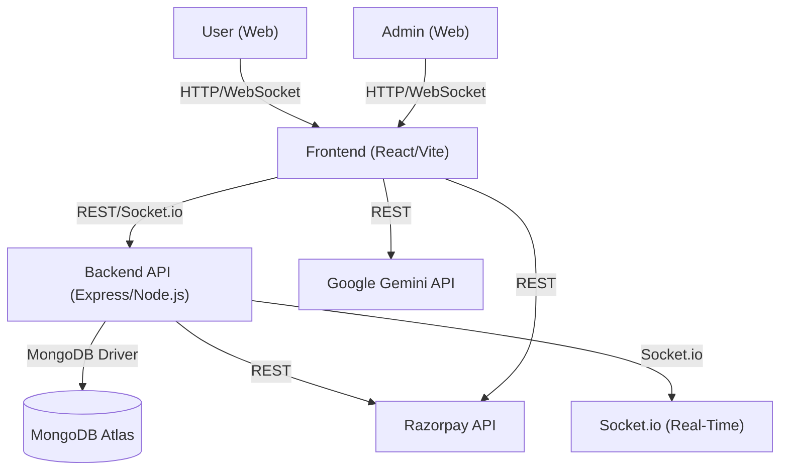

# High-Level Design (HLD)

## 1. System Overview
Smart Health Care is a full-stack web application enabling patients to consult doctors online, manage appointments, make payments, chat/video call, and access a wellness encyclopedia. Admins manage doctors, treatments, and payments.

---

## 2. Architecture Diagram

---

## 3. Major Modules

- **Frontend (React)**
  - User/Patient UI: Registration, login, search, booking, payments, chat, video, reviews, dashboard
  - Admin UI: Manage doctors, treatments, payments
  - AI Symptom Checker (Gemini)
  - Responsive, dark/light mode

- **Backend (Node.js/Express)**
  - Auth: JWT-based, role-based access
  - User, Doctor, Treatment, Appointment, Payment, Chat APIs
  - Real-time: Socket.io for chat/video
  - Payments: Razorpay integration
  - Logging, validation, error handling

- **Database (MongoDB)**
  - Users, Doctors, Treatments, Appointments, Payments, Chat messages

- **Third-Party Services**
  - Razorpay: Payment processing
  - Google Gemini: AI symptom analysis

---

## 4. Data Flow

1. User registers/logs in → JWT issued by backend
2. User searches doctors/treatments → REST API fetch
3. User books appointment → Backend checks slot, creates appointment
4. User pays online → Razorpay order via backend, payment status updated
5. User joins video/chat → Socket.io connection (JWT-authenticated)
6. Doctor/Patient exchange messages/video → Real-time via Socket.io
7. Admin manages data → Admin panel (protected routes)

---

## 5. Technology Choices

- **Frontend:** React 19, Vite, Tailwind CSS
- **Backend:** Node.js 18+, Express, TypeScript
- **Database:** MongoDB (Mongoose ODM)
- **Real-Time:** Socket.io
- **Payments:** Razorpay
- **AI:** Google Gemini
- **Testing:** Jest, Supertest, React Testing Library

---

## 6. Security

- JWT for all protected routes and real-time connections
- CORS restricted in production
- Input validation (Joi)
- Never commit secrets; use `.env`
- HTTPS enforced in production 