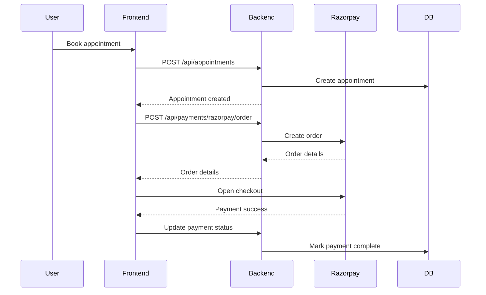
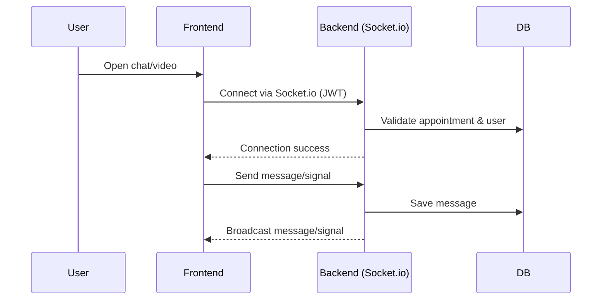

# Low-Level Design (LLD)

## 1. Data Models (Mongoose Schemas)

### User
```ts
{
  name: String,
  email: String,
  passwordHash: String,
  role: 'patient' | 'doctor' | 'admin',
  specialty?: String,
  qualifications?: [String],
  bio?: String,
  availability?: [{ day: String, times: [String] }],
  imageUrl?: String,
  location?: String,
  rating?: Number,
  reviews?: [{ patient: ObjectId, rating: Number, comment: String, date: Date }]
}
```

### Treatment
```ts
{
  name: String,
  category: String,
  description: String,
  imageUrl: String,
  benefits: [String],
  howToUse: String,
  disclaimer: String
}
```

### Appointment
```ts
{
  patient: ObjectId,
  doctor: ObjectId,
  slot: Date,
  status: 'pending' | 'confirmed' | 'completed' | 'cancelled',
  notes?: String,
  prescription?: [{ name: String, dosage: String, duration: String }]
}
```

### Payment
```ts
{
  patient: ObjectId,
  appointment: ObjectId,
  doctor: ObjectId,
  amount: Number,
  status: 'completed' | 'pending' | 'failed',
  gatewayTxnId?: String
}
```

### ChatMessage
```ts
{
  appointment: ObjectId,
  sender: ObjectId,
  message: String,
  timestamp: Date
}
```

---

## 2. API Endpoints (Sample)

### Auth
- POST /api/auth/register — Register user
- POST /api/auth/login — Login (user/admin)

### Doctors
- GET /api/doctors — List/search doctors
- GET /api/doctors/:id — Doctor details
- POST /api/doctors — Add doctor (admin)
- PUT /api/doctors/:id — Edit doctor (admin/doctor)
- DELETE /api/doctors/:id — Delete doctor (admin)
- POST /api/doctors/:id/reviews — Add review (patient)
- GET /api/doctors/:id/reviews — Get reviews

### Treatments
- GET /api/treatments — List/search
- GET /api/treatments/:id — Details
- POST /api/treatments — Add (admin)
- PUT /api/treatments/:id — Edit (admin)
- DELETE /api/treatments/:id — Delete (admin)

### Appointments
- POST /api/appointments — Book
- GET /api/appointments — List (role-based)
- GET /api/appointments/:id — Details
- PUT /api/appointments/:id — Update (doctor/admin)
- DELETE /api/appointments/:id — Cancel

### Payments
- POST /api/payments — Create payment
- GET /api/payments — List
- GET /api/payments/:id — Details
- PATCH /api/payments/:id/status — Update status (admin)
- POST /api/payments/razorpay/order — Create Razorpay order

### Chat
- GET /api/chat/:appointmentId — Get chat history

---

## 3. Sequence Diagrams

### A. Booking & Payment



### B. Real-Time Chat/Video



---

## 4. Frontend-Backend Integration

- All API calls use VITE_API_BASE_URL (set to backend deployment URL)
- Socket.io connects to backend using JWT for authentication
- Payments handled via backend-generated Razorpay orders

---

## 5. Validation & Error Handling

- All input validated with Joi (backend)
- Errors returned as { error: "message" } with appropriate HTTP status
- Frontend displays user-friendly error messages

---

## 6. Testing

- Backend: Jest + Supertest (unit/integration)
- Frontend: React Testing Library + Jest
- Test cases: See docs/test-cases.md

---

## 7. Security

- JWT required for all protected endpoints and real-time connections
- CORS restricted in production
- Passwords hashed with bcrypt
- No secrets in codebase; use .env 