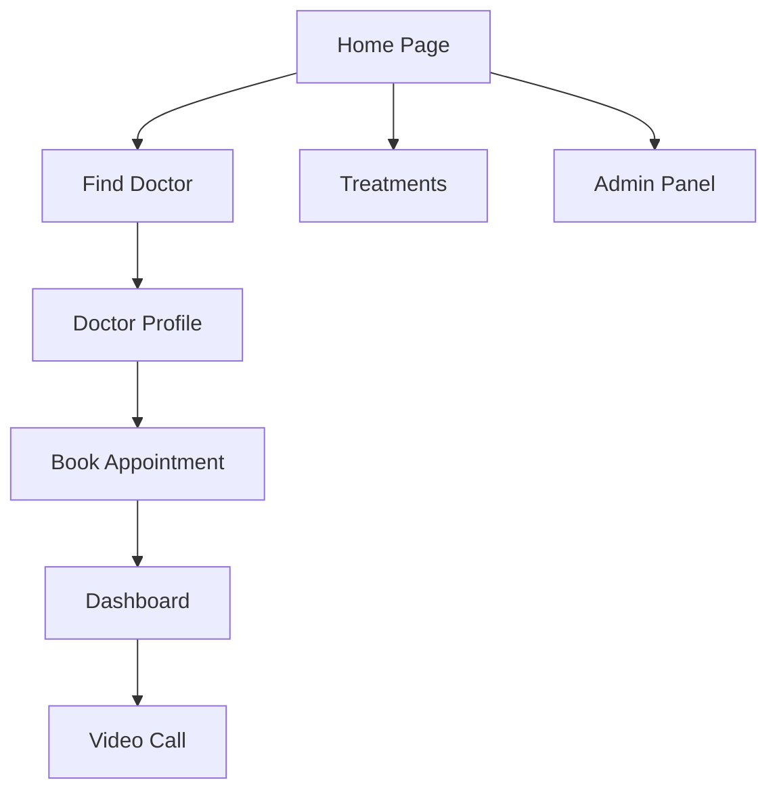

# Wireframes & UI Screens: Smart Health Care

---

## 1. Home Page
- Hero section: tagline, call-to-action buttons (Find Doctor, Explore Wellness)
- Features section: cards for Consultations, Wellness, Appointments
- AI Symptom Checker: textarea, submit button, result area
- Testimonials section
- Footer: links, contact info

## 2. Find Doctor Page
- Search/filter bar: specialty, location
- Grid of Doctor Cards: photo, name, specialty, location, rating, reviews
- Click doctor card → Doctor Profile

## 3. Doctor Profile Page
- Profile card: photo, name, specialty, location, rating, reviews
- Qualifications section
- Weekly availability: day/time slots (selectable)
- Book Appointment button
- Patient reviews section

## 4. Treatments Page
- Category filter bar
- Grid of Treatment Cards: name, category, image, short description
- Click treatment card → Treatment Detail

## 5. Appointment Booking Flow
- Select doctor and slot
- Confirm booking modal: doctor, date, time
- Payment modal (Razorpay)
- Success/failure feedback

## 6. Dashboard Page
- Upcoming appointments: list with status, actions (join call, pay, cancel)
- Past consultations: list with details
- Payment status chips
- Link to book new appointment

## 7. Video Call Page
- Video area: local video, remote video (future)
- Controls: mute/unmute, camera on/off, end call
- Timer
- Chat box below video

## 8. Admin Panel
- Sidebar: Dashboard, Manage Doctors, Manage Treatments, View Payments
- Dashboard: stats cards (doctors, treatments, patients, revenue)
- Manage Doctors: table, add/edit/delete
- Manage Treatments: table, add/edit/delete
- View Payments: table, update status

---

## (Optional) Mermaid UI Layout Example

